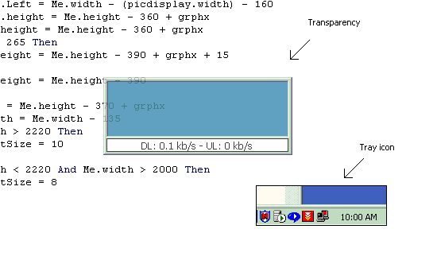



## Complete DL\-UL monitor

### Description

This is a complete DL-UL monitor, like DU-meter. It has similar functions, it shows a graph of your internet traffic or both a graph and numeric values. You can set the transparency of the graph-window and it can be minimized to system tray. You can see how much you've downloaded and uploaded in total. Please vote if you find it useful. And please, leave comments.
 
### More Info
 

             |
---                |---
**Submitted On**   |2002-01-09 10:08:16
**By**             |[Persona non grata](https://github.com/Planet-Source-Code/PSCIndex/blob/master/ByAuthor/persona-non-grata.md)
**Level**          |Intermediate
**User Rating**    |4.5 (85 globes from 19 users)
**Compatibility**  |VB 5\.0, VB 6\.0
**Category**       |[Complete Applications](https://github.com/Planet-Source-Code/PSCIndex/blob/master/ByCategory/complete-applications__1-27.md)
**World**          |[Visual Basic](https://github.com/Planet-Source-Code/PSCIndex/blob/master/ByWorld/visual-basic.md)
**Archive File**   |[Complete\_D47356192002\.zip](https://github.com/Planet-Source-Code/persona-non-grata-complete-dl-ul-monitor__1-30605/archive/master.zip)

### API Declarations

iphlpapi

